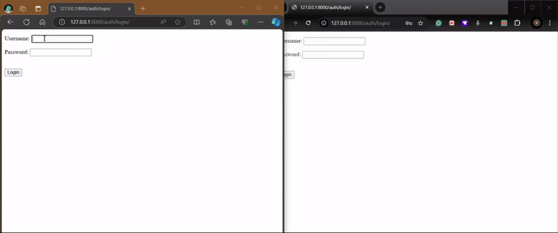

# Inital setup
- create venv
- create user by using cmd createsuperuser

# Deployment

run the server and move to the site and start two different browsers to log into two other users. It is because if you have logged in with first user credentials, the login details are stored in the cookies, then if you log in from second user details in the same browser even with different tabs, So, you cannot chat with two other users in the same browser, that’s why to use two different browsers. 

## Output

